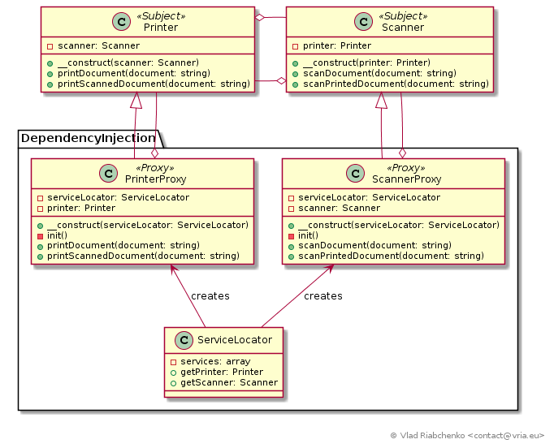

Proxy (Surrogate)
=================

Proxy stands in front of a useful object in order to intercept all requests to
it. There are many reasons to do that and therefore there ar many types of
proxy:

- *remote proxy* hides the fact that a real object is a remote one,
- *virtual proxy* provides optimizations like creating object on demand or 
  caching information,
- *protection proxy* controls access to object,
- *smart reference* allows various actions whenever an object is accessed.

See [https://en.wikipedia.org/wiki/Proxy_pattern](https://en.wikipedia.org/wiki/Proxy_pattern) for more information.

## Implementation



The example of implementation simulates a dependency injection service locator.
Service locator instantiates and returns an object of some service. It can be
a printer service capable to perform printing. If this printer service requires
another service to be passed to its constructor then the service locator will 
firstly instantiate this another service object and secondly pass it to the 
printer service's constructor:

```
/**
 * The printer depends on a Scanner object.
 */
class Printer {
    /** @var Scanner */
    private $scanner;

    /** @param Scanner $scanner */
    public function __construct(Scanner $scanner)
    {
        $this->scanner = $scanner;
    }
}
```

```
class ServiceLocator
{
    /**
     * Get an instance of a printer.
     * @return Printer
     */
    public function getPrinter()
    {
        $scanner = new Scanner();
        
        return new Printer($scanner);
    }
}
```

#### Lazy loading of services.

Let's assume that instantiating a `Scanner` service is a costly operation. On
the other hand `Printer` may perform many operations that don't use `Scanner`
and the only one operation that actually use `Scanner`:
```
/**
 * The printer uses scanner in rare cases.
 */
class Printer {
    /**
     * The rare function that uses `$this->scanner`.
     * Ask the scanner to scan a document then print this scanned document.
     *
     * @param $document
     */
    public function printScannedDocument($document)
    {
        $scanned = $this->scanner->scanDocument($document);

        return $this->printDocument($scanned);
    }
}
```
 
In this case it is a waste of resources to instantiate a new `Scanner` object 
every time we need the `Printer` service. So, we need to retrieve the `Scanner`
only when `printScannedDocument` method is called. The so-so solution is to
break dependency injection and pass `ServiceLocator` to `Printer` then ask it
for `Scanner` in `printScannedDocument` method. 

If the dependency injection needs to be kept, we can use the proxy of `Scanner` 
service:

```
/**
 * Proxy for Scanner service. It performs lazy-loading of a scanner object.
 * It instantiates a scanner object only when a call must be forwarded to it.
 */
class ScannerProxy extends Scanner
{
    /** @var Scanner */
    private $scanner;
    
    /** Creation of proxy costs nothing. */
    public function __construct()
    {
    }

    /** Instantiate $printer property with real printer object. */
    private function init()
    {
        $this->scanner = new Scanner();
    }

    /** @inheritdoc */
    public function scanDocument($document)
    {
        // Assure that the scanner is initialized.
        if (!$this->scanner) {
            $this->init();
        }

        // Forward call to real scanner object.
        return $this->scanner->scanDocument($document);
    }
}
```

The `ScannerProxy` costs nothing to create. It inherits from the `Scanner` and 
forwards requests to it. The `ScannerProxy` instantiates the `Scanner` only when 
the actual request arrives - the call of `scanDocument` method.

Service locator instantiates the `ScannerProxy` instead of the `Scanner`:
```
class ServiceLocator
{
    public function getPrinter()
    {
        $scanner = new ScannerProxy();
        
        return new Printer($scanner);
    }
}
```

#### Circular dependencies.

The `Printer` depends on the `Scanner`. Let's imagine that the `Scanner`
depends in turn on the `Printer`:

```
class Scanner
{
    /** @var Printer */
    private $printer;

    /** @param Printer $printer */
    public function __construct(Printer $printer)
    {
        $this->printer = $printer;
    }
    
    /** Ask the printer to print a document then scan this printed document. */
    public function scanPrintedDocument($document)
    {
        $printed = $this->printer->printDocument($document);

        return $this->scanDocument($printed);
    }
}
```

It would be difficult to instantiate these two classes that depend on each 
other. Virtual proxies easily resolve this issue:

```
/**
 * Proxy for Printer service. It performs lazy-loading of a printer object.
 * It instantiates a printer object only when a call must be forwarded to it.
 */
class PrinterProxy extends Printer
{
    /** @var ServiceLocator */
    private $serviceLocator;

    /** @var Printer */
    private $printer;

    /** @param ServiceLocator $serviceLocator */
    public function __construct(ServiceLocator $serviceLocator)
    {
        $this->serviceLocator = $serviceLocator;
    }

    /** Instantiate $printer property with real printer object. */
    private function init()
    {
        // Retrieve a scanner from the service locator.
        // It may be a proxy of the scanner.
        $scanner = $this->serviceLocator->getScanner();

        $this->printer = new Printer($scanner);
    }
    
    // The overriden Printer's methods. 
}
```

The `ScannerProxy` acts in the same way. The most beautiful thing is that 
`Printer`, `Scanner` and the client code that uses them are not aware of 
the proxies. Check out all the classes of this setting:

- [Printer]
- [Scanner]
- [DependencyInjection/PrinterProxy]
- [DependencyInjection/ScannerProxy]
- [DependencyInjection/ServiceLocator]

This approach is inspired by [the article of Marco Pivetta].

[Printer]: Printer.php
[Scanner]: Scanner.php
[DependencyInjection/PrinterProxy]: DependencyInjection/PrinterProxy.php
[DependencyInjection/ScannerProxy]: DependencyInjection/ScannerProxy.php
[DependencyInjection/ServiceLocator]: DependencyInjection/ServiceLocator.php
[the article of Marco Pivetta]: https://ocramius.github.io/blog/zf2-and-symfony-service-proxies-with-doctrine-proxies/
